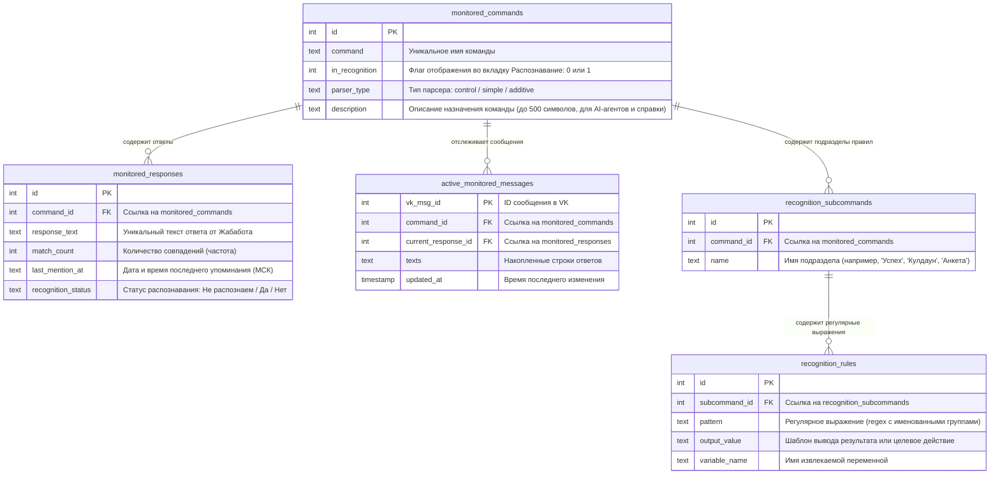

# Инструкция по системе мониторинга и распознавания правил VK ToadBot

Настоящий документ подробно описывает архитектуру, структуру базы данных, механизмы регулярных выражений, правила извлечения переменных и работу с веб-интерфейсом панели мониторинга и распознавания.

---

## 1. Архитектура и основные компоненты

Система состоит из двух независимых функциональных блоков, интегрированных в панель управления бота:
1. **Мониторинг ответов (Tab 1)**: Собирает и группирует все уникальные ответы Жабабота на заданные пользователем команды, считает частоту их появления, фиксирует дату последнего упоминания и позволяет отмечать статус готовности распознавания команды.
2. **Распознавание правил (Tab 2)**: Является интерактивным монитором правил разбора (на основе регулярных выражений), по которым бот парсит сообщения от Жабабота и обновляет внутреннюю базу данных (например, показатели сытости, кулдауны, уровни и т.д.).

> [!IMPORTANT]
> Система распознавания полностью изолирована от устаревших таблиц базы знаний (`commands_registry`, `response_templates`, `modular_line_templates`), которые сохранены только как рудимент совместимости и не изменяются в ходе работы новых функций.

---

## 2. Структура базы данных (SQLite)

Вся информация хранится в файле базы данных `data/bot.db`. Для реализации нового функционала используются 5 основных таблиц.

### Диаграмма связей таблиц (Схема БД)



---

## 3. Механизм распознавания и регулярные выражения

Распознавание основано на сопоставлении текста ответа Жабабота с регулярными выражениями (Regex) с именованными группами захвата.

### Как работает захват переменных:
1. Регулярное выражение в поле `pattern` описывает структуру строки ответа.
2. Для извлечения данных используются **именованные группы захвата** вида `(?P<имя_переменной>паттерн)`.
3. При успешном сопоставлении движок извлекает значение группы по её имени.
4. Значение подставляется в шаблон `output_value` с использованием фигурных скобок `{имя_переменной}`.

### Примеры посеянных правил:

#### Пример 1: Команда «Моя жаба» (Подраздел: «Анкета»)
* **Регулярное выражение (`pattern`)**: `Имя жабы: (?P<name>\S+)`
  * *Описание*: Ищет строку "Имя жабы: " и захватывает всё до первого пробела во временную переменную `name`.
  * *Шаблон вывода (`output_value`)*: `Имя = {name}`
* **Регулярное выражение (`pattern`)**: `Уровень вашей жабы: (?P<level>\d+)`
  * *Описание*: Ищет строку "Уровень вашей жабы: " и захватывает числовое значение в переменную `level`.
  * *Шаблон вывода (`output_value`)*: `Уровень = {level}`

#### Пример 2: Команда «Работа» (Подраздел: «Успех»)
* **Регулярное выражение (`pattern`)**: `отправилась на работу в (?P<work_place>[а-яА-Я]+)`
  * *Описание*: Находит текст отправки на работу и захватывает название места работы (только буквы) в переменную `work_place`.
  * *Шаблон вывода (`output_value`)*: `Статус = Работа, Место = {work_place}`

#### Пример 3: Команда «Работа» (Подраздел: «Кулдаун»)
* **Регулярное выражение (`pattern`)**: `жаба устала и отдыхает.*разрешит через (?P<hours>\d+) ч`
  * *Описание*: Находит сообщение о кулдауне и захватывает количество часов отдыха в переменную `hours`.
  * *Шаблон вывода (`output_value`)*: `Статус = Отдых, Осталось = {hours} ч`

---

## 4. Описание работы веб-интерфейса

Доступ к панели осуществляется через вкладку **«Мониторинг»** на главном экране. Внутри модального окна находятся две вкладки:

### Вкладка 1: «Мониторинг» (Панель сбора уникальных ответов)
* **Список команд**: Отображает древовидную таблицу всех отслеживаемых команд.
* **Раскрытие строк**: При клике на строку команды раскрываются все уникальные варианты ответов, присланные Жабаботом на эту команду.
* **Сортировка**: Варианты ответов автоматически сортируются **по убыванию частоты** (количества совпадений).
* **Кнопка «Свернуть все»**: Быстро сворачивает все открытые списки вариантов ответов.
* **Кнопка «Удалить» для вариантов ответов**: Маленькая красная кнопка справа в строке конкретного варианта ответа. Позволяет удалить ошибочно собранный или ненужный вариант из базы данных.
* **Столбец «Дата»**: Показывает московское время и дату (`ДД.ММ.ГГГГ ЧЧ:ММ:СС`) последнего получения именно этого варианта ответа.
* **Селектор «Распознавание»**: Отображается как самый последний столбец в строках вариантов ответов (вариаций) со следующими опциями:
  * `Не распознаем` — сбор материала / разработка правил.
  * `Да` — вариант ответа успешно распознается.
  * `Нет` — вариант ответа не распознается или отключен.
  * *Выбор сохраняется в БД моментально при смене опции для конкретного варианта.*
* **Зеленый фон для активных команд**: Если команда находится в режиме распознавания (добавлена во Вкладку 2 rules), то в таблице Мониторинга её текст подсвечивается зеленым фоном-бейджем.
* **Кнопка «Excel»**: Выгружает отчет в формате Excel (`monitor_report.xlsx`) с индивидуальной вкладкой под каждую команду. Вверху каждого листа пишется мета-информация (название команды), а таблица ответов сдвигается на 4-ю строку и содержит в качестве самого последнего столбца статус «Распознавание» для каждого варианта ответа.

### Вкладка 2: «Распознавание» (Монитор правил разбора)
* **Назначение**: Отображает действующие регулярные выражения и правила сопоставления (режим просмотра "только для чтения").
* **Бейдж типа парсера**: Рядом с именем каждой команды — цветной бейдж, показывающий `parser_type`:
  * 🟣 **контроль** (`control`) — полный снимок состояния, перезаписывает поля («Жаба инфо», «Моя жаба»).
  * 🔵 **простой** (`simple`) — распознаёт только результат действия: успех/кулдаун/ошибка («Работа»).
  * 🟠 **добавочный** (`additive`) — прибавляет/убавляет значения к текущим (лут, награды; «Покормить жабу»).
  * Критерии выбора типа — в `project_specs.md` § 6.2.
* **Описание команды (`description`)**: Под именем команды отображается серый текст описания назначения команды. Редактируется **inline-кликом** по тексту (появляется поле ввода; Enter или потеря фокуса — сохранение, Escape — отмена). Пустое описание скрывает строку. Назначение поля — контекст для AI-агента при выборе `parser_type` и справка для разработчика (см. `project_specs.md` § 6).
* **Кнопка «Добавить команду»**: Показывает выпадающий список команд из Вкладки 1, которые ещё не добавлены в мониторинг правил (у которых флаг `in_recognition = 0`). Выбор команды переключает её флаг на `in_recognition = 1` и отображает её в списке правил.
* **Кнопка «Удалить из распознавания»**: Убирает команду с вкладки «Распознавание» (переводит `in_recognition` обратно в `0`), не удаляя при этом сами правила из базы данных.
* **Двухуровневый аккордеон**:
  1. *Уровень 1 (Команда)*: Клик на имя команды загружает и раскрывает список подразделов (подкоманд).
  2. *Уровень 2 (Раздел)*: Клик на имя раздела (например, «Анкета», «Успех») раскрывает таблицу действующих правил регулярных выражений со столбцами:
     * *Вариант команды (Regex)* — шаблон регулярного выражения.
     * *Что распознаем* — результирующее форматированное выражение.
     * *Уникальное имя* — имя переменной для записи в БД.

### Вкладка 3: «Отладка» (Аудит нераспознанных ответов)
* **Назначение**: Показывает те варианты ответов Жабабота, для которых пользователь установил статус распознавания **«Нет»** (не распознаются полностью или содержат ошибки).
* **Поведение**:
  * В этой вкладке нет верхних кнопок управления («Добавить», «Свернуть все» и т.д.) — только аккордеон нераспознанных команд и таблица ответов.
  * Каждый нераспознанный ответ отображается с красными бейджами вида `❌ Анкета -> level`, показывающими, какое именно регулярное выражение не сработало для этого текста.
  * В таблице присутствует выпадающий список статуса «Распознавание» и кнопка удаления. Изменение статуса на «Да» или «Не распознаем» мгновенно исключает вариацию из списка отладки.
  * **Мигание кнопки Мониторинга**: Если в базе данных есть хотя бы одна вариация со статусом **«Нет»**, кнопка **«Мониторинг»** на главном экране начинает циклически мигать красным цветом (`pulse-red`), привлекая внимание администратора к необходимости отладки правил.

### Вкладка 4: «Тест» (Интерактивное тестирование распознавания)
* **Назначение**: Позволяет прогнать произвольный текст ответа Жабабота через выбранный парсер/правила и увидеть результат распознавания (статус «Да»/«Нет», извлечённые поля).

### Вкладка 5: «Аудит дельт» (Журнал инкрементов и ненаходов)
* **Назначение**: Показывает журнал событий записи в `toad_states`, связанных с **additive**-парсерами и правилами «ненахода».
* **События трёх типов** (цветные бейджи):
  * 🟠 **дельта** (`delta`) — прибавка/убавка значения: показывает величину инкремента и переход `старое → новое`.
  * 🔴 **ненаход** (`missing_required`) — обязательное поле не распознано: оставлено старое значение, сгенерировано предупреждение.
  * ⚪ **прочерк** (`optional_null`) — опциональное поле не распознано: записан NULL (прочерк).
* **Колонки таблицы**: Время, VK ID, Команда, Событие, Поле, Значение (дельта или комментарий), фрагмент сырого текста ответа.
* **Кнопка «Очистить»**: Полностью очищает таблицу `delta_audit`.
* **Зачем**: Видеть, что additive-парсеры корректно прибавляют лут/награды, и вовремя замечать, когда в ответе пропали обязательные поля (например, изменился формат текста Жабабота).

---

## 5. Добавление и обновление правил вручную (для разработчика)

Поскольку вкладка «Распознавание» работает в режиме монитора (Read-Only), новые правила добавляются разработчиком напрямую в базу данных через SQLite-запросы или скрипты инициализации в файле `src/database/db_manager.py`.

### Пример SQL-скрипта для добавления нового правила:

```sql
-- 1. Добавляем новый подраздел (подкоманду) для команды 'Работа' (допустим, у нее command_id = 4)
INSERT INTO recognition_subcommands (command_id, name) 
VALUES (4, 'Опыт');

-- 2. Получаем ID созданного подраздела (допустим, он равен 12)
-- 3. Добавляем правило регулярного выражения для извлечения опыта
INSERT INTO recognition_rules (subcommand_id, pattern, output_value, variable_name)
VALUES (12, 'получено (?P<xp>\d+) ед. опыта', 'Опыт = +{xp}', 'xp');
```

При перезапуске сервера или повторном открытии вкладки «Распознавание» новое правило мгновенно отобразится в соответствующей таблице аккордеона.
